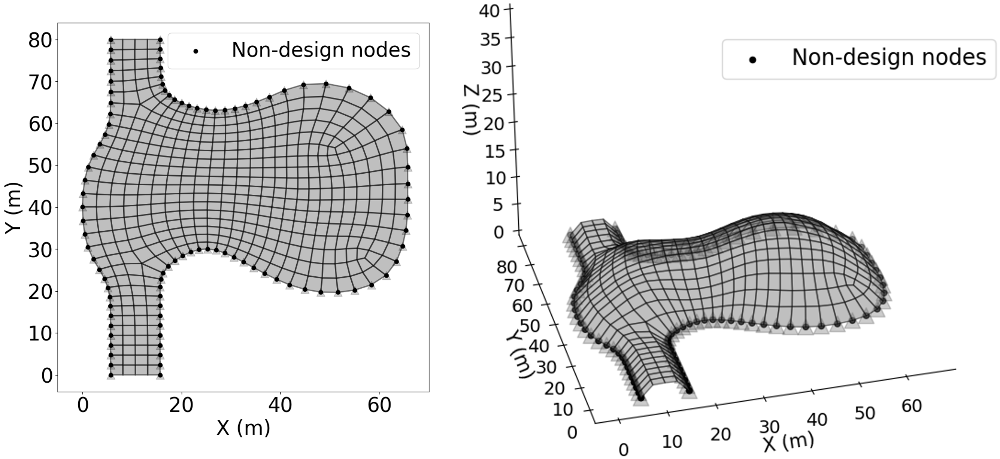
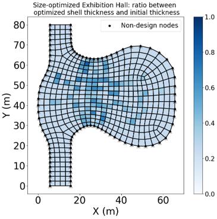
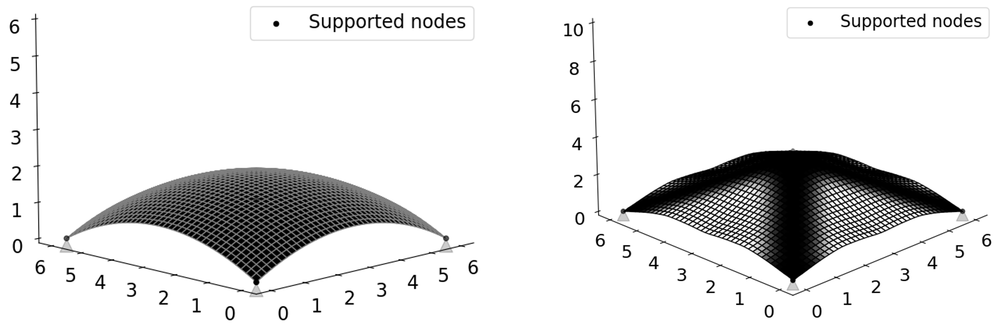
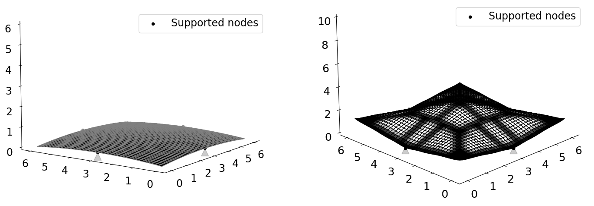
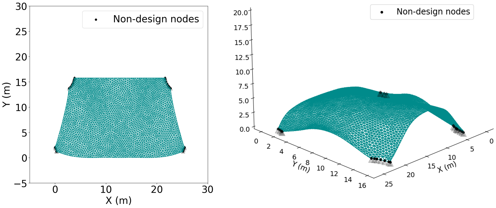

# JaxSSO
A differentiable finite element analysis (FEA) solver for structural optimization, enabled by [JAX](https://github.com/google/jax).

Developed by [Gaoyuan Wu](https://gaoyuanwu.github.io/) @ Princeton.

## Features

* Automatic differentiation (AD): an easy and accurate way for gradient evaluation. The implementation of AD avoids deriving derivatives manually or trauncation errors from numerical differentiation.
* Acclerated linear algebra (XLA) and just-in-time compilation: these features in JAX boost the gradient evaluation
* Hardware acceleration: run on GPUs and TPUs for **faster** experience
* Support beam-column elements and MITC-4 quadrilateral shell elements
* Shape optimization, size optimization and topology optimization
* Seamless integration with machine learning (ML) libraries

## Usage

### Installation
Install it with pip: `pip install JaxSSO`

### Dependencies
JaxSSO is written in Python and requires:
* [numpy](https://numpy.org/doc/stable/index.html) >= 1.22.0.
* [JAX](https://jax.readthedocs.io/en/latest/index.html): "JAX is [Autograd](https://github.com/hips/autograd) and [XLA](https://www.tensorflow.org/xla), brought together for high-performance machine learning research." Please refer to [this link](https://github.com/google/jax#installation) for the installation of JAX.
* [Nlopt](https://nlopt.readthedocs.io/en/latest/): Nlopt is a library for nonlinear optimization. It has Python interface, which is implemented herein. Refer to [this link](https://nlopt.readthedocs.io/en/latest/NLopt_Installation/) for the installation of Nlopt. Alternatively, you can use `pip install nlopt`, please refer to [
nlopt-python](https://pypi.org/project/nlopt/).
* [scipy](https://scipy.org/).


### Quickstart
The project provides you with interactive examples with Google Colab for quick start. No installation locally is required. 
* [Shape optimization of continuous shell](https://colab.research.google.com/github/GaoyuanWu/JaxSSO/blob/main/Examples/Shells_Mannheim_Multihalle_Shape.ipynb)



* [Size (thickness) optimization of continuous shell](https://colab.research.google.com/github/GaoyuanWu/JaxSSO/blob/main/Examples/Shells_Mannheim_Multihalle_Size.ipynb)


* [Simultaneous shape & topology optimization](https://colab.research.google.com/github/GaoyuanWu/JaxSSO/blob/main/Examples/shells_topo_shape.ipynb)



* [Simultaneous shape & topology optimization-2](https://colab.research.google.com/github/GaoyuanWu/JaxSSO/blob/main/Examples/shells_topo_shape_2.ipynb)



* [Shape optimization of grid shell](https://colab.research.google.com/github/GaoyuanWu/JaxSSO/blob/main/Examples/Gridshell_Station_Shape.ipynb): geometry from [Favilli et al. 2024](https://github.com/cnr-isti-vclab/GeomDL4GridShell#geometric-deep-learning-for-statics-aware-grid-shells)




## Cite us
Please star, share our project with others and/or cite us if you find our work interesting and helpful.

We have a new manuscript under review.

Our previous work can be seen in this [paper](https://link.springer.com/article/10.1007/s00158-023-03601-0).
Cite our previous work using:
```bibtex
@article{wu_framework_2023,
	title = {A framework for structural shape optimization based on automatic differentiation, the adjoint method and accelerated linear algebra},
	volume = {66},
	issn = {1615-1488},
	url = {https://doi.org/10.1007/s00158-023-03601-0},
	doi = {10.1007/s00158-023-03601-0},
	language = {en},
	number = {7},
	urldate = {2023-06-21},
	journal = {Structural and Multidisciplinary Optimization},
	author = {Wu, Gaoyuan},
	month = jun,
	year = {2023},
	keywords = {Adjoint method, Automatic differentiation, Bézier surface, Form finding, JAX, Shape optimization, Shell structure},
	pages = {151},
}


```
