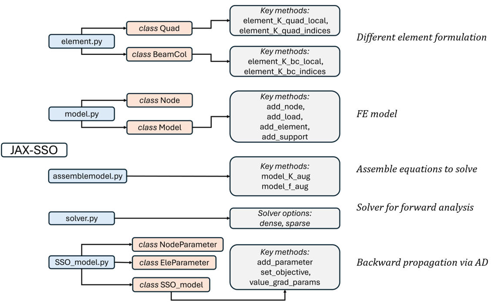
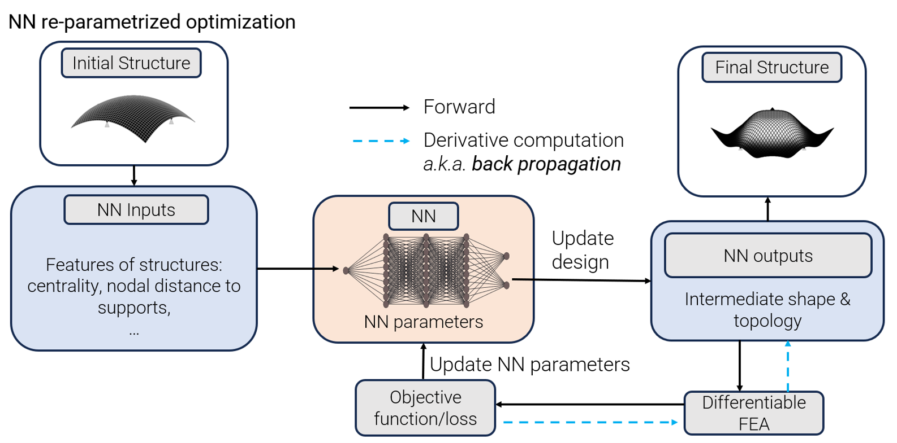
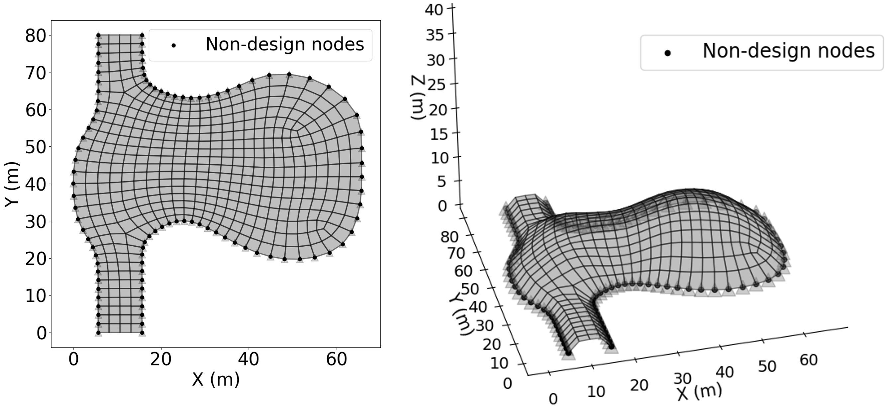
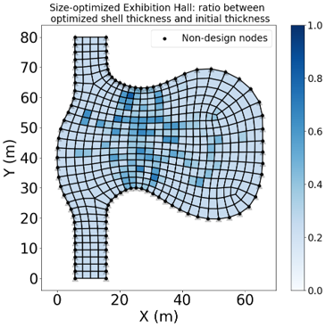
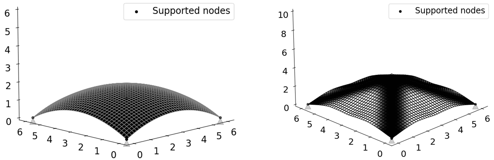
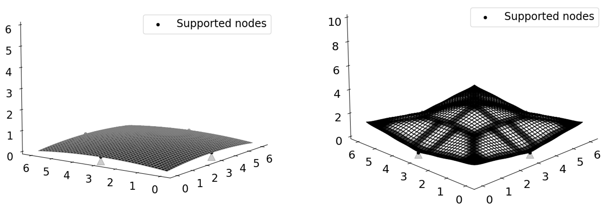
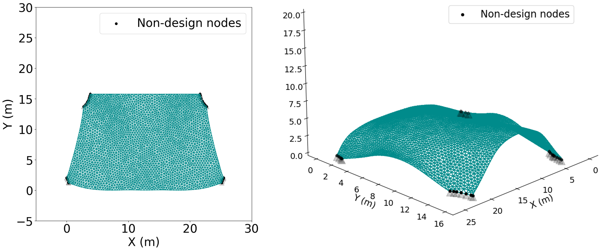

# JaxSSO
A differentiable finite element analysis (FEA) solver for structural optimization, enabled by [JAX](https://github.com/google/jax).

Developed by [Gaoyuan Wu](https://gaoyuanwu.github.io/) @ Princeton.

## Features

* Automatic differentiation (AD): an easy and accurate way for gradient evaluation. The implementation of AD avoids deriving derivatives manually or trauncation errors from numerical differentiation. AD is handy for sensitivity analysis of gradient-based optimization and training of neural networks (NN) with differentiable physics.
* Acclerated linear algebra (XLA) and just-in-time compilation: these features in JAX boost the gradient evaluation
* Hardware acceleration: run on GPUs and TPUs for **faster** experience
* Support beam-column elements and MITC-4 quadrilateral shell elements
* Shape optimization, size optimization and topology optimization
* Seamless integration with machine learning (ML) libraries

## Overview
An overview of the package structure of JaxSSO is shown in the following figure.


The  `element.py` module is related to underlying mechanics and formulations of different structural elements, such as beam-columns and MITC4 shells.

The `model.py` module creates a finite element model to be analyzed. Users use this module to add structural elements, specify boundary conditions, and impose loads. 

The `assemblemodel.py` module assembles the linear system equations $\boldsymbol{K} \boldsymbol{u} = \boldsymbol{f}$ to be solved, where $\boldsymbol{K}$ is the global stiffness matrix, $\boldsymbol{u}$ is the solution, and $\boldsymbol{f}$ is the external load.

The `solver.py` module conducts forward analysis and solves for the solution $\boldsymbol{u}$ with various solvers: dense, sparse, on CPUs or GPUs.

The `SSO_model.py` module is for backward propogation/optimization. Users can specify various parameters and objective function. Derivatives are then obtained in an automated manner thanks to AD.



## Usage

### Installation
Install it with pip: `pip install JaxSSO`

### Dependencies
JaxSSO is written in Python and requires:
* [numpy](https://numpy.org/doc/stable/index.html) >= 1.22.0.
* [JAX](https://jax.readthedocs.io/en/latest/index.html): "JAX is [Autograd](https://github.com/hips/autograd) and [XLA](https://www.tensorflow.org/xla), brought together for high-performance machine learning research." Please refer to [this link](https://github.com/google/jax#installation) for the installation of JAX.
* [scipy](https://scipy.org/).

Optional:
* [Nlopt](https://nlopt.readthedocs.io/en/latest/): Nlopt is a library for nonlinear optimization. It has Python interface, which is implemented herein. Refer to [this link](https://nlopt.readthedocs.io/en/latest/NLopt_Installation/) for the installation of Nlopt. Alternatively, you can use `pip install nlopt`, please refer to [
nlopt-python](https://pypi.org/project/nlopt/).
* [Flax](https://flax.readthedocs.io/en/latest/): neural network library based on JAX. JAXSSO can be integrated with `flax`, please see `Examples/Neural_Network_Topo_Shape.ipynb`
* [Optax](https://optax.readthedocs.io/en/latest/): optimization library based on JAX, can be used to train neural networks.


### Quickstart
The project provides you with interactive examples with Google Colab for quick start. No installation locally is required. 
* [Integration of neural networks with differentiable physics](https://colab.research.google.com/github/GaoyuanWu/JaxSSO/blob/main/Examples/Neural_Network_Topo_Shape.ipynb)



* [Shape optimization of continuous shell](https://colab.research.google.com/github/GaoyuanWu/JaxSSO/blob/main/Examples/Shells_Mannheim_Multihalle_Shape.ipynb)



* [Size (thickness) optimization of continuous shell](https://colab.research.google.com/github/GaoyuanWu/JaxSSO/blob/main/Examples/Shells_Mannheim_Multihalle_Size.ipynb)


* [Simultaneous shape & topology optimization](https://colab.research.google.com/github/GaoyuanWu/JaxSSO/blob/main/Examples/shells_topo_shape.ipynb)



* [Simultaneous shape & topology optimization-2](https://colab.research.google.com/github/GaoyuanWu/JaxSSO/blob/main/Examples/shells_topo_shape_2.ipynb)



* [Shape optimization of grid shell](https://colab.research.google.com/github/GaoyuanWu/JaxSSO/blob/main/Examples/Gridshell_Station_Shape.ipynb): geometry from [Favilli et al. 2024](https://github.com/cnr-isti-vclab/GeomDL4GridShell#geometric-deep-learning-for-statics-aware-grid-shells)




## Cite us
Please star, share our project with others and/or cite us if you find our work interesting and helpful.

We have a new [manuscript](https://arxiv.org/abs/2407.20026) under review.

Our previous work can be seen in this [paper](https://link.springer.com/article/10.1007/s00158-023-03601-0).
Cite our previous work using:
```bibtex
@article{wu2023framework,
  title={A framework for structural shape optimization based on automatic differentiation, the adjoint method and accelerated linear algebra},
  author={Wu, Gaoyuan},
  journal={Structural and Multidisciplinary Optimization},
  volume={66},
  url = {https://doi.org/10.1007/s00158-023-03601-0},
  doi = {10.1007/s00158-023-03601-0},
  pages={151},
  year={2023},
  publisher={Springer}
}
```
